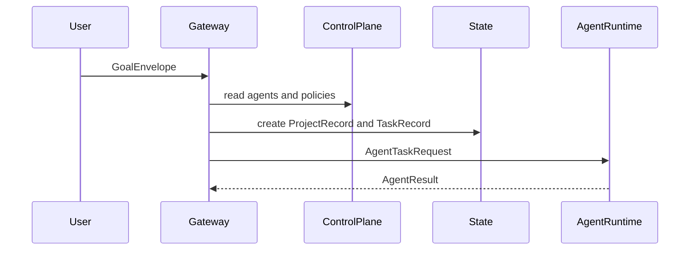

# Architecture Skeleton

Synarch is organized as a monorepo that mirrors the nine layers described in the README.

## Runtime Boundaries

- `packages/gateway`: public FastAPI entrypoint for goals, validation callbacks, and dashboard reads.
- `packages/control-plane`: deterministic org, agent, capability, permission, and policy registry.
- `packages/state-service`: canonical project/task/event/checkpoint storage.
- `packages/memory-service`: memory item storage facade and context assembly boundary.
- `packages/event-service`: event ingestion facade, ready to publish to NATS.
- `packages/agent-runtime`: persistent division-agent execution facade.
- `packages/frontend`: Next.js dashboard for projects, agents, timeline, reviews, connector jobs, and metrics.
- `shared/models`: Pydantic contracts shared by all Python services.

## Phase 1 Contract Flow

## Persistence Plan

The skeleton includes the first PostgreSQL schema in `packages/state-service/migrations/0001_initial.sql`.
The current FastAPI services use in-memory stores so the boundaries can be tested before SQLAlchemy/SQLModel
repositories are introduced.
